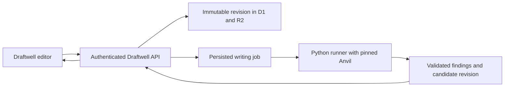

# Bringing Anvil into Draftwell

Assessment: 2026-09-11. Inspected GitHub main: Draftwell `e1dff67`; Anvil `422a295d`. Anvil's source declares 0.11.5; the latest published GitHub release observed was 0.11.0. Pin an exact tested commit rather than assuming main and release tags match.

Recommendation: make Draftwell the interactive editor and review workspace, and progressively use Anvil as the shared writing engine. Start with deterministic Python libraries behind a narrow service boundary. Move model-driven phases after proving the adapter contract. This assessment preceded implementation. The initial pinned Python adapter, authenticated API, and editor checks are now implemented locally; model-phase orchestration and production runner hosting remain future work. See [WORK_PLAN.md](../WORK_PLAN.md).

## How the writing system evolved

| Area | Draftwell today | What Anvil adds | Proposed use |
|---|---|---|---|
| Author voice | Profiles exist but do not reach live document review/revision | Style guide, vocabulary, values, and exemplar corpus; deductions grounded in samples | Editable author/project voice with evidence-linked feedback |
| Reviews | Flat findings; metadata lost on reload | Versioned schema, critic identity, dimensions, evidence spans, proposed fixes, judgment/tool-evidence/vision kinds | Complete immutable review payloads with UI status stored separately |
| Quality gates | Regex styleguide plus persona review | Numeric consistency, quote/evidence verification, scorecard arithmetic, source and render checks | Cheap checks before model review; heuristic style findings stay advisory |
| Revision control | Immediate replacement and summary banner | Immutable versions, change logs, word-level prose diff, scoped/planned revision conventions | Candidate preview, scoped fixes, acceptance, and history |
| Stopping rules | Manual revise/refine in the live API | Threshold, critical block, plateau, iteration cap, explicit termination reason | Bounded improvement jobs that explain why they stopped |
| Purpose | Generic document workflow | Artifact-specific rubrics and project briefs | Start with essay and memo modes |
| Revision side effects | No cross-reference repair contract | Essay findings can predict downstream effects; stale-token checks cover companion files | Repair dependent claims in the same pass and preserve what works |

The relationship is already two-way: Anvil's [rhetoric linter](https://github.com/rjwalters/anvil/blob/422a295d/anvil/lib/rhetoric_lint.py) explicitly credits Draftwell's styleguide rule-set model. It has since gained frequency rules, sentence-complexity checks, comma stacking, project overrides, and suppression mechanisms. Two independently evolving implementations would increase drift.

Voice fits Draftwell's original promise especially well. Anvil distinguishes who the author is, how they sound, words they avoid, and published examples that prove the voice. Samples can override generic lint defaults. Draftwell could retain onboarding while producing these editable grounding inputs. See [voice grounding](https://github.com/rjwalters/anvil/blob/422a295d/anvil/lib/snippets/voice_grounding.md).

Anvil separates writing judgment from factual verification. A polished draft is not automatically verified. Preserve this distinction in the UI; model criticism alone is not a fact-check. See [review schema](https://github.com/rjwalters/anvil/blob/422a295d/anvil/lib/review_schema.py) and [shared primitives](https://github.com/rjwalters/anvil/blob/422a295d/anvil/lib/README.md).

## What is actually reusable

Python APIs include `lint_rhetoric(text)`, `numeric_consistency.check_text(text)`, `diff_prose(before, after)`, `Review` validation, aggregation, scorecard checking, and `decide_termination(...)`. Some wrappers require filesystem paths, but text functions provide a small initial surface. Exported JSON schemas can support a TypeScript consumer.

I ran 529 existing Anvil tests across review schema, convergence, rhetoric lint, numeric consistency, prose diff, aggregation, scorecard arithmetic, evidence checks, and revision consistency; all passed. Direct calls validated an example review, detected the false claim “70 points ahead” for scores 70 and 56, generated a word insertion diff, and returned STALLED for an explicitly configured flat score history. These used local fixtures without model calls or network verification.

The writing phases themselves are largely Markdown command specifications interpreted by an agent. Installing the Python project does not supply a ready-made `reviewDocument()` API that executes essay-review or memo-revise. Essay's latest downstream-risk annotation is a prose workflow contract: its typed schema has a corresponding optional field, but the essay command does not automatically emit typed reviews. An adapter must own execution and result normalization.

Anvil's [packaging](https://github.com/rjwalters/anvil/blob/422a295d/pyproject.toml) declares Python 3.10+, Pydantic, and PyYAML, with optional rendering extras. Its comments identify editable source installation as the supported path and no distributed wheel. Its npm package is a private development scaffold, not a runtime library. Rendered-artifact paths invoke programs such as pandoc and XeLaTeX. Directly importing the project into Draftwell's TypeScript Pages Functions is not the immediate route.

## Dependency options

| Option | Benefit | Cost / limitation | Assessment |
|---|---|---|---|
| Copy rules and prompts into TypeScript | Small change, existing deployment | Forked behavior and ongoing synchronization | Only for a deliberate short-lived prototype |
| Pin schemas and selected workflow content | Shared contracts, no Python runtime yet | No shared execution or Python checks | Good preparatory step |
| Pinned Python dependency behind an internal API/job runner | Tested implementations and one source for writing rules | Additional runtime and adapter; model phases still need orchestration | Recommended target, starting small |
| Install the full agent/filesystem workflow | Maximum reuse for offline authors | Filesystem conventions do not directly match multi-user web requests | Possible offline bridge, not the first web integration |

## Proposed boundary

Draftwell owns authentication, authorization, projects, editing, storage, review presentation, and revision acceptance. The Anvil runner owns deterministic checks and, later, execution of selected writing phases.

The API resolves ownership before constructing a job. The runner receives a scoped snapshot, not client-selected storage paths. Record document/revision IDs, content hash, artifact kind, rubric version, voice snapshot, Anvil commit, model configuration, and limits. Return schema-versioned findings with evidence anchors and an optional candidate revision. Preserve the complete Anvil payload separately from Draftwell finding IDs and resolution statuses; do not overload upstream fields.

For full workflows, materialize Anvil version directories inside a job-specific temporary workspace and import results to R2. D1 remains the application's source of truth for identity, progress, and accepted revisions. This preserves immutable-version semantics without making a shared filesystem the tenant boundary.

Map upstream `version_dir` to a specific Draftwell revision. Validate both schema shape and scorecard arithmetic. Do not hardcode /40 or /44 across rubrics. Set iteration limits explicitly: `decide_termination` defaults are not a product policy. If the editor changes during a job, present a conflict instead of applying stale output.

## Implementation sequence

1. **Repair authorization, autosave, and revision races.** These remain Draftwell responsibilities. Add the missing backend/package checks.
2. **Build a small adapter proof.** Input: revision identity and Markdown. Output: rhetoric findings, numeric findings, and word-level diff. Start with in-memory rules and text APIs. Pin the Git source and resolved Python dependencies, test compatibility fixtures, and measure latency. Preserve MIT notices for vendored code/contracts.
3. **Adopt review and voice contracts.** Add editable purpose/audience/length inputs, essay or memo rubrics, voice docs and exemplars, and complete review storage. Anchor findings to the reviewed revision.
4. **Add asynchronous model phases.** Persist jobs with progress, cancellation, bounded iterations, and idempotent results. Execute a controlled set of Anvil instructions through a model/agent adapter. Review produces feedback; revision produces a candidate; acceptance is explicit.
5. **Evaluate retirement of duplicated packages.** Compare the user's drafts for useful findings, false positives, voice preservation, cost, and latency. Remove duplication after documenting parity and intentional differences. Retain fast local checks where they improve responsiveness.

Start with one document and one review/revision loop. Citation services, PDF/vision critics, decks, and multi-document assembly can follow demonstrated demand.

## Remaining gaps

Anvil has not finished persistent cross-version claim verification. [Issue #1198](https://github.com/rjwalters/anvil/issues/1198), split from [#888](https://github.com/rjwalters/anvil/issues/888), remains open: unchanged claims can be repeatedly checked while inherited unverified claims are missed. Downstream-effect annotations have landed; the claim ledger is separate unfinished work. Draftwell should contribute to the shared primitive if needed rather than build an incompatible ledger.

Numeric checks cover constrained arithmetic patterns, not general factual truth, and tolerate rounding. Rhetoric lint stays advisory because legitimate voice choices can match its rules. The passing tests support individual primitives; model quality and multi-user deployment suitability still require the adapter prototype and a small writing evaluation.
